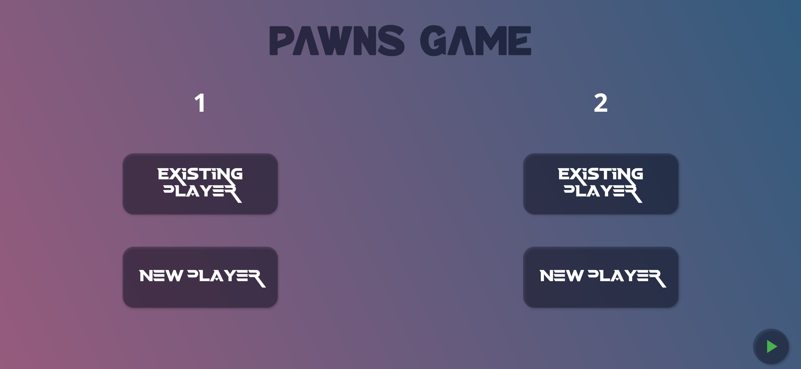
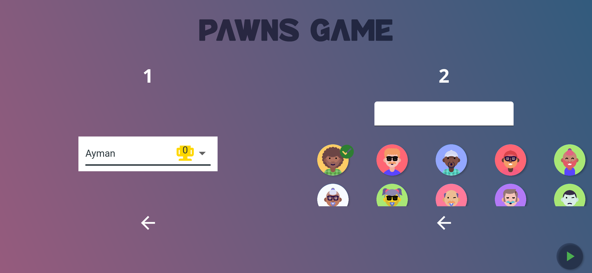
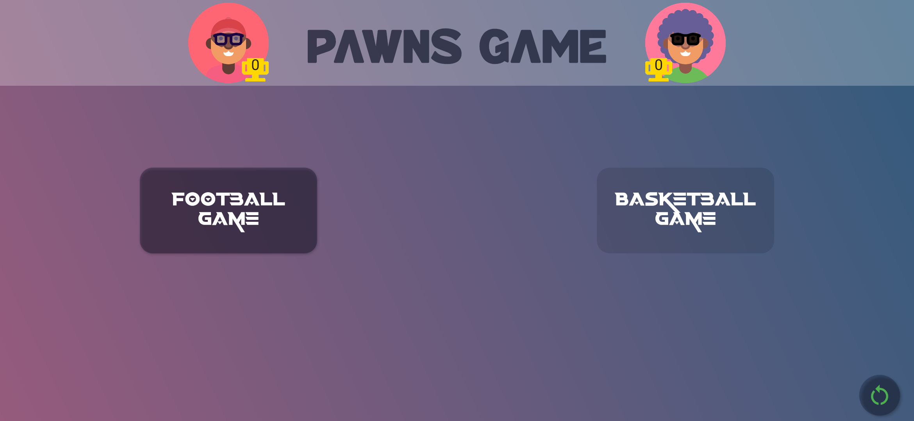
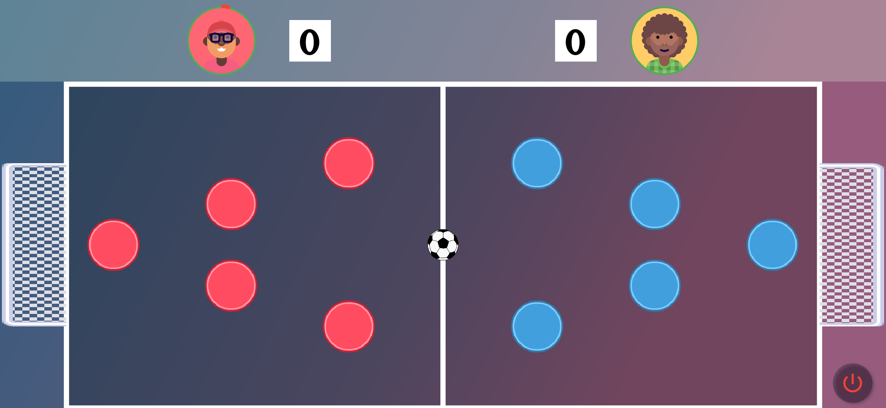

 
<h1> PAWNS GAME </h1>

_By Ayman Adil (Last source code update: 07/08/2021)_

## Description

Pawns Game is a two-players offline game that contains different pawns game modes such as football mode and basketball mode.

Each player has to choose between creating a new player or choosing an existing one.

Then choose a game mode to play.

All players' wins will be saved at the end of the game.

### Football mode

Score two goals to win.

### Basketball mode

Not available in this version.

## Screenshots

### Prestart screen

  

  

### Home screen

  

### Football mode screen

  

## Want to test the game?

You can install `pawns_game.apk` on your device.

## Credits

- Application logo: https://dribbble.com/shots/15458614-G-P-logo-design-concept

- Players' avatars are generated with https://personas.draftbit.com/

- Football image: https://www.clipartmax.com/middle/m2i8H7A0N4A0A0m2_image-dessin-ballon-de-foot-nouveau-photographie-image-football-ball-vector/

- Pawns images: https://kenney.nl/assets/rolling-ball-assets

- Goals images: https://kenney.nl/assets/sports-pack

- Trophy image: https://kenney.nl/assets/game-icons

Thanks to them!

